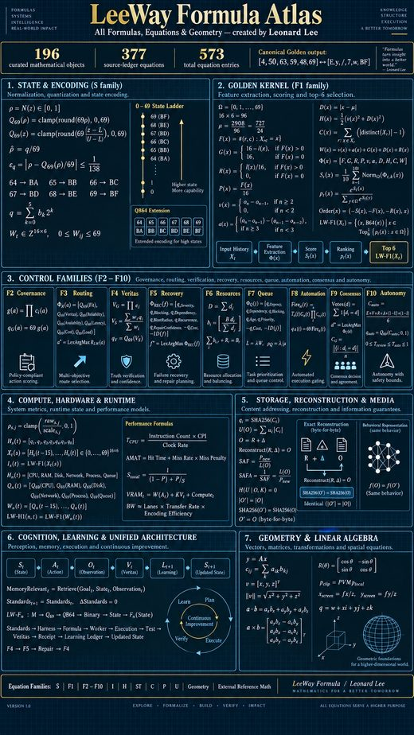

# LeeWay Formula Live

  

<strong>LeeWay Formula Atlas</strong> All Formulas, Equations & Geometry · Created by Leonard Lee

## A mathematical engineering system created by Leonard Lee

**Creator:** Leonard Lee  
**Organization:** LeeWay Industries  
**Canonical Formula:** LEEWAY-FORMULA-v1.0

LeeWay Formula is a deterministic mathematical control fabric for turning measured evidence into bounded state, detecting patterns over time, governing admissibility, routing capabilities, allocating resources, verifying outcomes, recovering from failures, and admitting only verified learning.

The Formula is **not an LLM**. The decision mathematics does not originate from a model, agent, CPU or GPU. A physical/digital substrate still evaluates the equations and performs the selected action.

> **LeeWay thesis:** minimize unnecessary physical work, cognitive work, data movement, latency, risk and redundancy subject to truth, exactness, governance, goal satisfaction and available resources.

---

## Start here

- [Scientific Map](docs/SCIENTIFIC-MAP.md) — top view → street view → evidence
- [Origin & Thesis](docs/01-ORIGIN-AND-THESIS.md)
- [Mathematics](docs/02-MATHEMATICS.md)
- [Equation Atlas](docs/EQUATION-ATLAS.md)
- [Complete Mathematical Engineering Textbook v2](docs/reference/LeeWay-Formula-Mathematical-Engineering-Textbook-v2.html)
- [Canonical Q69 + F1 equation page](docs/equations/FOUNDATION-Q69-F1.md)
- [Formula Funnel for LLM/context decision engineering](docs/03-FORMULA-FUNNEL.md)
- [Evidence Status](docs/EVIDENCE-STATUS.md)
- [Failure & Repair Ledger](docs/FAILURES-AND-REPAIRS.md)
- [Reproducibility](docs/REPRODUCIBILITY.md)

### Domain chapters

- [CPU](docs/domains/CPU.md)
- [GPU / VRAM](docs/domains/GPU-VRAM.md)
- [PCIe / Interconnect](docs/domains/PCIE-INTERCONNECT.md)
- [USB / Device I/O](docs/domains/USB-DEVICE-IO.md)
- [Storage / Media](docs/domains/STORAGE-MEDIA.md)
- [Models / Runtime](docs/domains/MODELS-RUNTIME.md)
- [Context / Decision Engineering](docs/domains/CONTEXT-DECISION.md)

---

# The Formula at a glance

## 1. Normalize evidence

[
\rho=\mathcal N(z)\in[0,1]
]

## 2. Map to LeeWay state

[
\boxed{Q_{69}(\rho)=\operatorname{clamp}(\operatorname{round}(69\rho),0,69)}
]

The state universe is:

[
\Omega=\{0,1,\ldots,69\}
]

States 64–69 extend the Base64 display family:

[
64\to BA, 65\to BB, 66\to BC, 67\to BD, 68\to BE, 69\to BF
]

## 3. Build a 16×6 history

[
W_t\in\mathbb Z^{16\times6},\qquad 0\le W_{ij}\le69
]

The Golden historical kernel evaluates **96 observations**.

## 4. Evaluate every state

Recovered historical features include:

[
F,G,R,P,v,a,D,H,C,W
]

with:

[
D(x)=\left|x-\frac{727}{24}\right|
]

[
H(x)=\frac12(v(x)^2+D(x)^2)
]

[
W(x)=v(x)+a(x)+G(x)+D(x)+R(x)
]

Each feature is normalized across the complete 70-state universe.

## 5. Rank

[
S_t(x)=\frac1{10}\sum_{k=1}^{10}Norm_\Omega(\Phi_{t,k}(x))
]

Frozen deterministic tie order:

[
Order(x)=(-S(x),-F(x),-R(x),x)
]

## 6. Golden result

[
\boxed{[4,50,63,59,48,69]}
]

QB64 display:

[
\boxed{[E,y,/,7,w,BF]}
]

A different result means the input, implementation, arithmetic contract or version is not the certified Golden path.

---

# Formula families

The LeeWay Formula project extends beyond one ranking kernel.

| Family | Responsibility |
|---|---|
| F1 | Historical pattern / state ranking |
| F2 | Governance / eligibility |
| F3 | Routing |
| F4 | Veritas / evidence |
| F5 | Recovery |
| F6 | Resource allocation |
| F7 | Queue policy |
| F8 | Automation |
| F9 | Consensus |
| F10 | Autonomy |

Not every family has the same proof status. Open closure/audit gaps are printed instead of hidden.

---

# How Formula applies to hardware

The Formula does not replace CPU/GPU/PCIe/USB physics. It turns **measured hardware behavior into governed state**.

Hardware state example:

[
H_n(t)=[CPU,RAM,Disk,Network,Process,Queue]
]

[
Q_n(t)=[Q_{69}(CPU),\ldots,Q_{69}(Queue)]
]

[
LW-H1(n,t)=LW-F1([Q_n(t-15),\ldots,Q_n(t)])
]

Different domains use different adapters and actuators under the same Formula authority.

---

# Current measured evidence

## CPU

A CPU-only 1.5B model campaign showed that more threads were not monotonically better.

- 6 threads: efficiency point
- 8 threads: lowest client latency
- 10 threads: strong throughput mode
- high thread counts created more paging/context-switch pressure

See [CPU](docs/domains/CPU.md).

## GPU / VRAM

Measured GPU working-set ladder reached:

[
\boxed{11.18\times}
]

from about 3.192 GB VRAM to about 285 MB while still GPU-resident.

16× target remains **NOT REACHED** because a single measured GPU layer already exceeded the complete 16× VRAM budget.

See [GPU / VRAM](docs/domains/GPU-VRAM.md).

## Models

A real quantized GGUF compressed only ~2.13% under generic exact compression. That failure redirected research from opaque byte compression toward model-state representation and runtime working-set control.

See [Models / Runtime](docs/domains/MODELS-RUNTIME.md).

## Phone / media

Galaxy Z Fold6 experiments established device authority, native ARM64 llama.cpp execution, exact media reconstruction, and media-domain representations.

Examples from tested samples:

- JPEG XL image reductions: ~44–74% depending content/quality
- Opus speech: ~82–89% reduction at the selected 24 kb/s validation point
- HEVC/AV1 video: strong reductions, but content-sensitive fidelity means no universal fixed policy was promoted

See [Storage / Media](docs/domains/STORAGE-MEDIA.md).

---

# Formula Funnel

For agents/LLMs, LeeWay applies a governed decision funnel:

[
Continuity\to Context\to Formula\to Capability\to Runtime\to Veritas\to Receipt\to Learning
]

At multiple stages it asks:

1. **What are we not discovering?**
2. **What needs to be enhanced?**

The Funnel does not expose private chain-of-thought or fabricate Formula states. It structures evidence, provenance, authority, constraints and recovery so the model works inside a stronger decision environment.

See [Formula Funnel](docs/03-FORMULA-FUNNEL.md).

---

# Scientific claim law

Every important claim must be identifiable as one of:

**CANONICAL LEEWAY · PROVEN LEEWAY · CANDIDATE/PROPOSED · EXTERNAL MATHEMATICS · HISTORICAL EVIDENCE · OPEN GAP/BLOCKED**

Permanent distinctions:

- mounted ≠ executed
- running ≠ healthy
- configured ≠ proven
- generated ≠ executed
- executed ≠ verified
- relocation ≠ compression
- behavioral equivalence ≠ byte identity
- model output ≠ proof

PASS and FAIL are both preserved.

---

# Evidence structure

- `authority/` — Formula identity and live authority evidence
- `contracts/` — consumer/evaluator/ecosystem contracts
- `experiments/` — raw scientific experiment records
- `receipts/` — promotion/execution receipts
- `docs/` — mathematical/scientific explanation
- `scripts/` — client invocation helpers

Applications should call the centralized Formula service/client contract rather than embed divergent Formula implementations.

---

# Canonical service boundary

Local compatibility base:

`http://127.0.0.1:4001`

- `GET /runtime/formula/v1/health`
- `POST /runtime/formula/v1/evaluate`

The browser/publication layer does not simulate Formula output.

---

# Reproduce or challenge it

Start with [Reproducibility](docs/REPRODUCIBILITY.md).

A reviewer should be able to identify:

- the equation,
- version/hash,
- raw input,
- Formula state,
- selected policy,
- physical execution,
- before/after measurements,
- regressions,
- failures,
- receipt,
- and remaining blocker.

That is the standard this repository is being rebuilt to meet.
